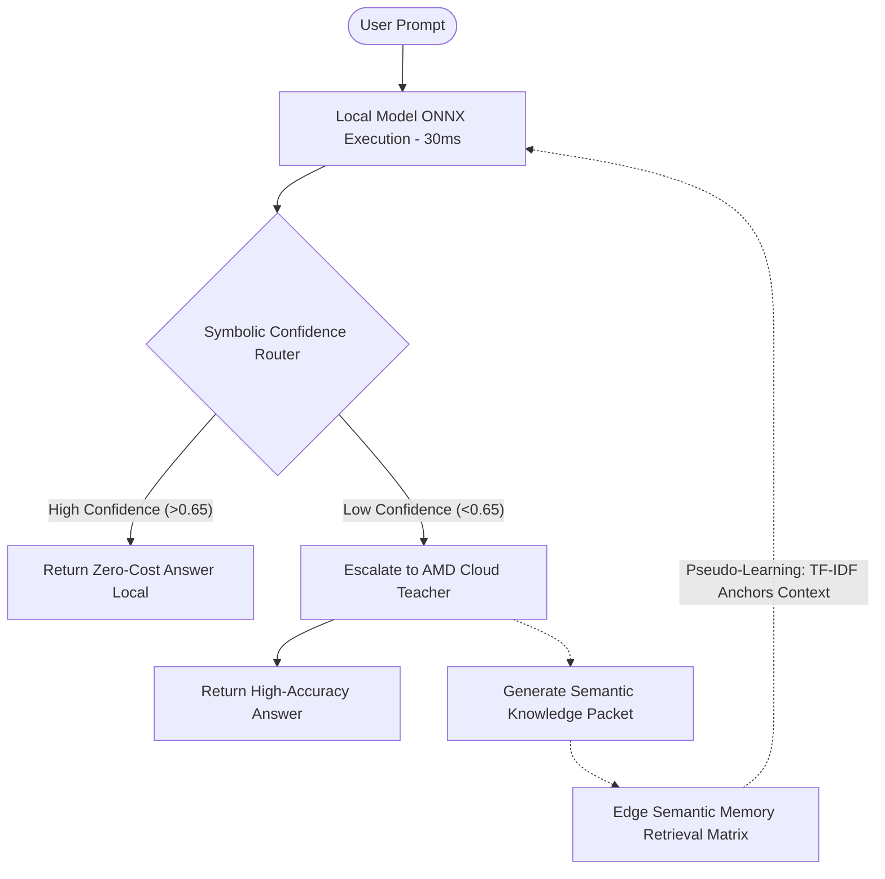

# Evolution Edge: Self-Evolving AI Bridge

**A dynamic, neuro-symbolic routing engine that transforms edge inference from static to self-improving, leveraging AMD’s Instinct™ MI300X and Ryzen™ AI NPUs.**

## 💡 The Concept: Self-Evolving Edge AI
Traditional edge AI is static. Once deployed, edge models cannot learn new facts or adapt their reasoning. Cloud AI is smart but suffers from high latency, massive operational costs, and privacy risks.

**Evolution Edge** solves this with a **lifelong learning pipeline**. 
A lightweight local model (Qwen1.5/Llama) acts as a high-speed, zero-cost edge endpoint. A **Symbolic Router** evaluates the local model's confidence and complexity limits in real-time. If the local system fails the threshold, the query escalates to a powerful Cloud Teacher Agent (simulated AMD Instinct™ MI300X). 

The Teacher doesn't just answer the question; it returns a densely packed **Knowledge Packet**—containing synthesized few-shot examples, token entropy reasoning, embeddings, and topics. The edge device ingests this packet, **updating its local semantic memory (via TF-IDF/Jaccard retrieval)** to "evolve." Next time that topic is queried, the local model solves it instantly.

## 🚀 Why AMD? The Hardware Advantage

Evolution Edge is designed explicitly to exploit AMD's unified heterogeneous ecosystem:

1. **The Edge (Ryzen™ AI NPU / ROCm™):** The local quantized ONNX model executes flawlessly on mobile CPU/NPU pipelines using `CPUExecutionProvider` and `VitisAIExecutionProvider`, maximizing battery life and ensuring 30ms-level inference latency.
2. **The Cloud (Instinct™ MI300X):** When escalation occurs, the deep Teacher distillation process runs on MI300X infrastructure. This generates structured knowledge packages almost instantly, feeding semantic data back down to the edge.

## 🧠 Architecture Flow



## 📊 Performance Story & Metrics Dashboard

Evolution Edge provides a real-time UI dashboard tracking exact performance gains:

* **Latency Arbitrage:** See exact timings mapping the Local Edge (<50ms) vs Cloud Fallback (~800ms).
* **Cost Savings Tracker:** The dashboard dynamically tracks API dollar savings for every task successfully routed to the local NPU.
* **Semantic Pseudo-Learning:** Knowledge base size tracks identically with Teacher distillation, shifting the load off the cloud over time. Look under `tests/` for the exact mathematical validation of dynamic Jaccard thresholds.

## 🛠️ Setup Instructions

1. **Install Dependencies:**
   ```bash
   pip install -r requirements.txt
   ```
2. **System Bootstrap (Local weights):**
   ```bash
   python setup_local.py
   ```
3. **Launch the Real-time Dashboard:**
   ```bash
   python app.py
   ```
*(A port mapping instance will bind on `http://127.0.0.1:7860`)*

## 🧪 Testing Suite

We implemented an Engineering-grade `unittest` suite validating the core deterministic rules.
Execute the validation matrix via:
```bash
python -m unittest discover tests
```
*Validates Adaptive Threshold scaling, Q/A extraction loops, and Semantic Semantic Memory isolation bounds.*
